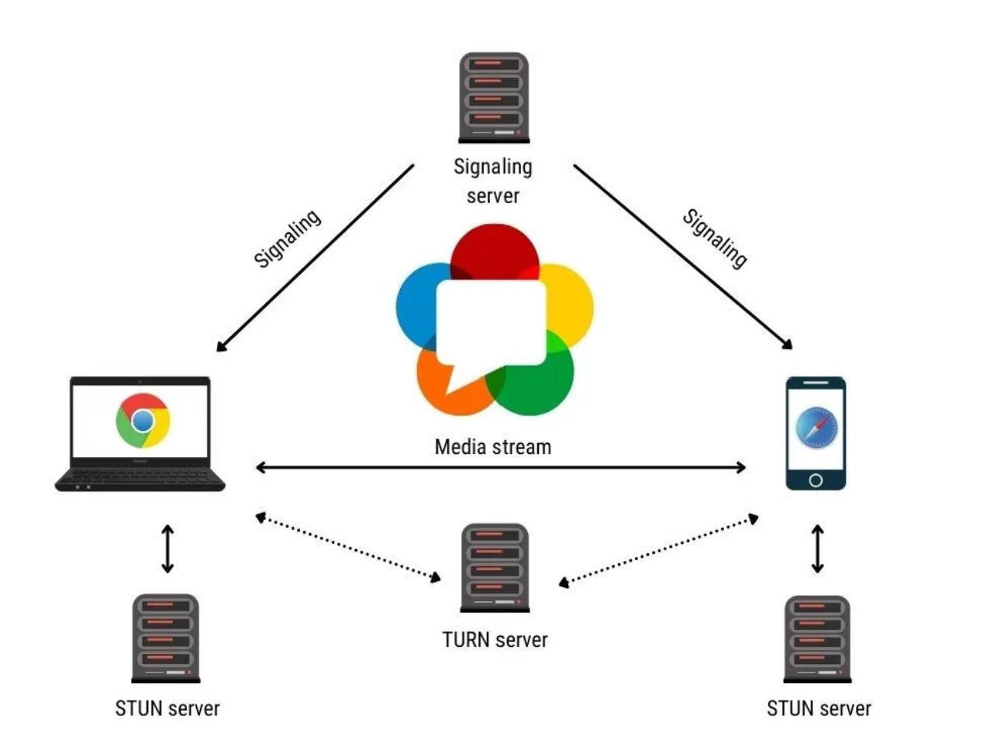
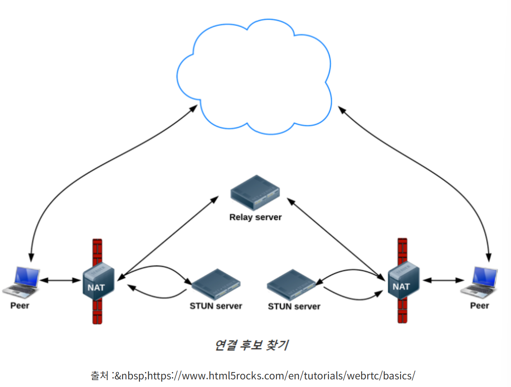
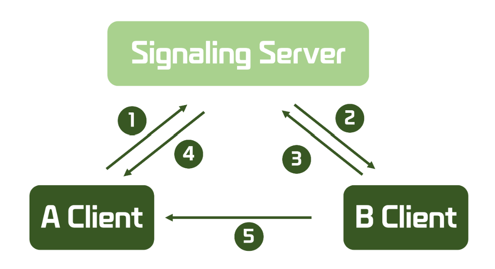
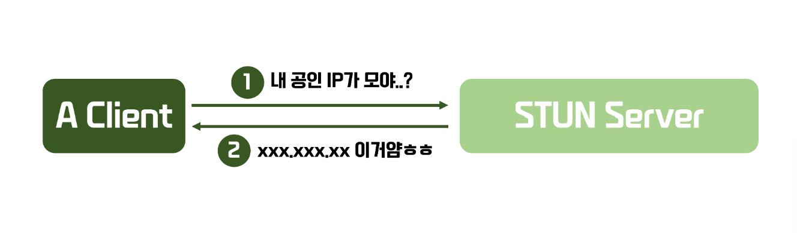
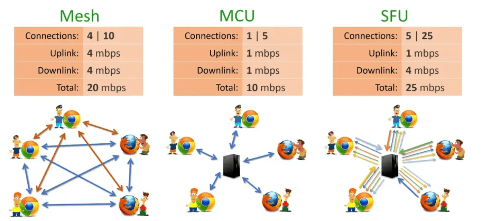
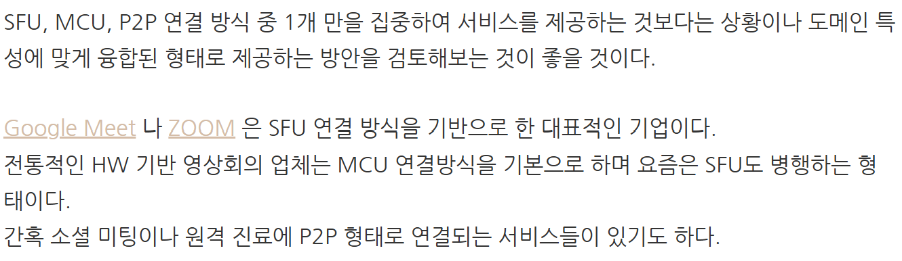

# WebRTC

## WebRTC란 무엇인가?

Web Real-Time Communication

1. WebRTC 작동 Flow

별도의 플러그인 설치 없이 실시간으로 미디어를 최대한 **서버를 거치지 않고 Peer간 전송**할 수 있는 오픈 소스 웹 기반 기술

핵심 : **실시간**으로 사용자 간 데이터를 교환하면서도 **보안**과 **지연 최소화**를 보장하며, 브라우저 간 네이티브 지원을 통해 플러그인 없는 원활한 경험을 제공

- 웹/앱에서 별다른 소프트웨어 없이 카메라, 마이크 등을 사용하여 실시간 커뮤니케이션을 제공해주는 기술
- 화상통화, 화상 공유 등을 구현할 수 있는 오픈 소스
- 비디오, 음성 및 일반 데이터가 P2P방식으로 피어간의 전송되도록 지원
- 시그널링 서버가 필요
- JvaScript API로 제공

### 장점

1. 짧은 Latency → Real-Time과 비슷한 방송이 가능
2. 별다른 소프트웨어 없이 실시간 커뮤니케이션이 가능하다
3. 개발하는 데 있어 진입장벽이 낮다
4. 무료

### 단점

1. 크로스 브라우징 문제
    - 많은 브라우저에서 사용이 가능하지만, 사람들이 잘 사용하지 않는 브라우저나 최신 버전을 사용하지 않는 사용나즌 사용이 불가능
    ⇒ Internet Explorer는 지원되지 않는다.
2. STUN/TURN 서버 필요
- Peer to Peer 통신을 하기 위해서는 사용자의 IP주소를 알아야 함
- Public IP는 요청을 보낼 때 마다 Private에서 Public을 NAT에 의해 바뀌기 때문에 동일한 Public IP로 통신할 수없는 문제점이 발생
- NAT와 방화벽 때문에 WebRTC 통신에 문제가 생김
⇒ STUN/TURN 서버로 해결 가능

### 통신 원리

Peer to Peer 통신:  

- 하나의 컴퓨터와 하나의 컴퓨터가 데이터를 주고 받는 형식
- 동등 계층 간 클라이언트/서버의 개념이 없이 동등한 노드들로 구성되어 데이터를 주고 받는다.

---

## 서버의 종류

### 1. Signaling Server

WebRTC에서 가장 기본이 되는 서버

WebRTC와는 별개로 Signaling Server는 구축해야 한다.

**시그널링이란?**

서로 다른 네트워크에 있는 2개의 디바이스들을 통신하기 위해서는, 각 디바이스들의 위치(IP) 발견 및 미디어 포맷협의가 필요하다.

이 때 `Session Control Messages`, `Error essages`, `Codec`, `Bandwith` 등 다양한 정보가 필요한데, 각각의 Peer들에게 정보를 전달하는 프로세스를  `Signaling`이라고 한다.

각 디바이스들을 상호간에 동의된 서버(socket.io 혹은 websocket을 이용한 서버)에 연결시킨다.

**이러한 정보들을 중계해주는 역할을 하는 서버: `Signaling Server`**

위의 정보들은 **SDP(Session Description Protocol)**을 사용한다.

일반적으로 클라이언트 사이드와 WebSocket을 사용하여 통신한다.

**① Client Side의 A Client(Peer)에서** Signaling Server로 연결에 필요한 A의 데이터를 보낸다.

=>**`Signaling Offer`**

**② Server Side**에서, Signaling Server에 연결된 모든 세션들에게 A의 데이터를 전달한다.

**③ Client Side의 B Client(Peer)에서** A의 데이터를 활용해서 연결에 필요한 일련의 작업을 한 후, B의 데이터를 Signaling Server로 보낸다.

=> **`Signaling Answer`**

**④ Server Side**에서, A Client의 세션에게 B Client의 데이터를 전달한다.

**⑤** 각각의 데이터를 활용하여 WebRTC가 A Client와 B Client가 연결한다.

시그널링 서버는 두가지 종류의 서버가 필요하다.

세션 서버: room에 누가 있는지, 그리고 누가 들어오는지 나가는지를 관여할 Http 서버

채널 서버: offer/answer를 중계하기 위한 websocket 서버

물론, 세션서버가 없이 채널서버만으로 request, respnse 처리 및 room 관리를 해도 무관하다. 채널 서버를 분산처리 하지 않을것이라면 말이다. 이말은 즉슨, 세션서버는 채널서버의 분산처리까지 담당한다는 뜻이다. 

시그널링 서버는 SDP와 ICE Negotication을 이해하지 못하면 절대 만들수 없다

### 2. STUN Server(Session Traversal Utilities for NAT)

 `Signaling Server`을 이용해서 Peer간의 통신이 가능하다. 하지만 통신 중간에 **방화벽, NAT 환경에 놓여 있는 Peer에 대해서는 직접적인  Signaling이 불가능**하다. 이때에  `STUN Server`와 `TURN Server`가 필요하게 된다.

**`STUN Server` : 클라이언트 자신의 공인 IP(Public Address)를 알려주는 서버**

Client에서 STUN Server로 요청을 보내서 자신의 공인 IP를 확인한 후, 해당 IP를 활용하여 Signaling하게 된다.

STUN Server는 직접 구현할 필요없이 이미 만들어진 **오픈 소스, Google 등에서 운영하는 STUN Server**를 사용해도 된다.

STUN Server는 단순히 정보 제공을 위한 서버라 트래픽 발생이 현저히 낮기 때문에 웬만하면 무료 STUN Server를 사용해도 크게 문제가 없다고 함.

### 3. TURN(Traversal Using Relays around NAT) Server

`STUN Server`를 활용하면 대략 80% 정도는 Signaling을 통한 연결이 가능하다. 하지만 그렇지 못한 20%의 경우도(보호정책이 강한 NAT나 라우터, 보통 Symmetric NAT 환경)에서 나타난다.

`TURN Server`는 Symmetric NAT 제한을 우회할 수 있게끔 해주는 기능을 하는데, **결국 `TURN Server`가 Peer간의 통신 채널을 중계해주는 역할을 하면서 WebRTC의 가장 큰 특징인 P2P 방식에서 벗어나게 된다**.

때문에 Peer간 모든 트래픽을 중계해주기 때문에 상당한 부하를 감당해야하며, 비용 또한 크게 발생할 것이다.

즉, Local IP와 Public IP 둘다로도 연결할 수 없는 경우 `TURN Server`을 **최후의 수단으로 사용**하게 된다.

안정적인 서비스를 위해서는 TURN 서버를 직접 운영하는 것이 필요하다. 보통 [COTURN](https://velog.io/@jsb100800/github.com/coturn/coturn)이라는 오픈 소스를 활용해 TURN 서버를 구축하는 것을 권장한다.

### 4. Media Server

WebRTC의 구현 방식에는 크게 3가지로 `Mesh`, `SFU`, `MCU` 방식이 있다.

지금까지 위에서 말한 방식은 `Mesh` 방식으로 **서버의 자원이 적게들지만 Peer 수가 늘어날 수록 Client 사이드의 과부하가 급격하게 증가한다.** 때문에 소규모 연결에 적합하다. `Mesh` 방식에서는 `Media Server`가 필요하지 않다. 

`Media Server`: 

- `SFU`, `MCU` 방식의 WebRTC에서 필요한 서버
- 각 Peer는 미디어 스트림을 Media Server에 전송하고, Media Server는 이 미디어 트래픽을 관리하여 다시 각 Peer에게 배포하는 멀티미디어 미들웨어

즉, WebRTC의 특징은 본래 **P2P 통신**을 기반으로 하지만, 이 방식에서는 **TURN Server**와 유사하게 동작한다고 볼 수 있다. 클라이언트의 부하는 현저히 줄어드는 반면, 서버의 부하가 증가하며, 구현 난이도가 상당히 높다.

`Media Server`가 언제, 왜 필요할지에 대해서 제대로 이해하기 위해서 **WebRTC 구현 방식**에 대해서 알아야 한다.

---

## **WebRTC 구현 방식의 종류**

**WebRTC의 구현 방식에는 크게 3가지로 `Mesh`, `SFU`, `MCU` 방식이 있다.**

### 1. Mesh 방식

- **특징**
    - Signaling Server, STUN Server, TURN Server를 사용하는 **전형적인 P2P WebRTC 구현 방식이다.**
    - **1:1 연결 혹은 소규모 연결에 적합하다.**
- **장점**
    - Peer간의 Signaling 과정만 서버가 중계하기 때문에 **서버의 부하가 적다.**
    - 직접적으로 Peer간 연결되기 때문에 **실시간성이 보장**된다.
- **단점**
    - 연결된 Client의 수가 늘어날 수록 **Client의 과부하가 급격하게 증가한다**
    - N명이 접속한 화상회의라면, 클라이언트 각각에서 N-1개의 연결을 유지해야 한다.

### 2. MCU(Multi-point Control Unit) 방식

- **특징**
    - 다수의 송출 미디어 데이터를 **Media Server에서 혼합(muxing) 또는 가공(transcoding)하여 수신측으로 전달하는 방식**
    - P2P 방식이 아니다. **클라이언트 peer간 연결이 아닌, Server와 Client 간의 peer를 연결한다.**
    - Media Server의 매우 높은 컴퓨팅 파워가 요구된다.
- **장점**
    - **Client의 부하가 크게 줄어든다.**
    - **N:M 구조에서 사용 가능하다.**
- **단점**
    - **실시간성이 저해된다.**
    - 구현 난도가 상당히 어려우며 **비디오와 오디오를 혼합 및 가공하는 과정에서 고난도 기술과 서버의 큰 자원이 필요하다.**

### 3. SFU(Selective Forwarding Unit) 방식

- **특징**
    - 각 Client 간의 미디어 트래픽을 중계하는 **`Media Server`를 두는 방식.**
    - P2P 방식이 아니다. **클라이언트 peer간 연결이 아닌, Server와 Client 간의 peer를 연결한다.**
    - Server에게 자신의 영상 데이터를 보내고, 상대방의 수만큼 데이터를 받는 형식.
    - 1:N 혹은 소규모 N:M 형식의 실시간 스트리밍에 적합하다.
- **장점**
    - Mesh 방식보다 느지만 **비슷한 수준의 실시간성을 유지할 수 있다.**
    - Mesh 방식보다는 Client의 부하가 줄어든다.
- **단점**
    - Mesh 방식보다는 **서버의 부하가 늘어난다.**
    - **대규모 N:M 구조에서는 여전히 Client의 부하가 크다.**

